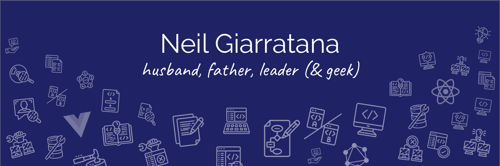

> ### The world is run by those who show up - _Robert B. Johnson_

I'm Neil -- husband, father, coach, live (sports) streamer, programmer, serverless architect, leader, and recovering entrepreneur.  My personal mission is to help software engineers find joy in their work by sharing knowledge and reducing friction.

- 🔭 I’m currently leading the design and development of a multi-instance digital experience platform that ensures seamless experiences while empowering autonomous teams
- 🌱 I'm currently digging pretty deeply into delivery (and caching) optimization options for a multi-billion user platform to optimize cost AND deliver faster time to first byte (TTFB)
- 📚 I'm currently reading [The Medici (Italian Histories)](https://a.co/d/35Wh5Ad) and [Engineering Management for the Rest of Us](https://a.co/d/4G0Qfun)
- 💬 Ask me about microfrontends, serverless applications, scaling teams and projects, removing friction for developers

### Skills & Experience

### Favorite Software Engineering Books

- [The Pragmatic Programmer, 20th Anniversary Edition your journey to mastery](https://pragprog.com/titles/tpp20/the-pragmatic-programmer-20th-anniversary-edition/) by David Thomas & Andrew Hunt
- [Clean Code](https://www.amazon.com/Clean-Code-Handbook-Software-Craftsmanship/dp/0132350882) by Robert C. Martin (Uncle Bob)
- [Refactoring, Improving the Design of Existing Code](https://martinfowler.com/books/refactoring.html) by Martin Fowler, with Kent Beck
- [Implementing Lean Software Development](https://a.co/d/geugtX0) by Mary Poppendieck, Tom Poppendieck
- [Accelerate: The Science of Lean Software and DevOps: Building and Scaling High Performing Technology Organizations](https://a.co/d/cbd183h) by by Nicole Forsgren PhD, Jez Humble, Gene Kim

### In my queue...

- [Lean Enterprise: How High Performance Organizations Innovate at Scale](https://a.co/d/do2eoF9) by  Jez Humble, Joanne Molesky, Barry O'Reilly
- [Remote Team Interactions Workbook: Using Team Topologies Patterns for Remote Working](https://a.co/d/bu4sfUx) by Matthew Skelton, Manuel Pais
- [Remote Not Distant: Design a Company Culture That Will Help You Thrive in a Hybrid Workplace](https://a.co/d/ioGaZlL) by Gustavo Razzetti

### 2023 Reading List

- [Implementing Lean Software Development](https://a.co/d/geugtX0) by Mary Poppendieck, Tom Poppendieck
- [Accelerate: The Science of Lean Software and DevOps: Building and Scaling High Performing Technology Organizations](https://a.co/d/cbd183h) by by Nicole Forsgren PhD, Jez Humble, Gene Kim
- [Reality-Based Leadership: Ditch the Drama, Restore Sanity to the Workplace, and Turn Excuses into Results](https://a.co/d/ivZbOst) by Cy Wakeman
- [Radical Candor](https://www.amazon.com/Radical-Candor-Revised-Kick-Ass-Humanity-ebook/dp/B07P9LPXPT) (Yes...again with our leadership team) by Kim Scott
- [Smart Brevity: The Power of Saying More with Less](https://a.co/d/crXthZR) by  Jim VandeHei, Mike Allen, Roy Schwartz
- [The Nature of Software Development: Keep It Simple, Make It Valuable, Build It Piece by Piece](https://a.co/d/51EA8Gd) by Ron Jeffries
- [The Subtle Art Of Not Giving A F*Ck: A Counterintuitive Approach To Living A Good Life](https://a.co/d/8CjhJr4) by Mark Manson

### 2022 Reading List

- [75+Team Building Activities for Remote Teams: Simple Ways to Build Trust, Strengthen Communications, and Laugh Together from Afar](https://a.co/d/4upuZZm) by Christopher Littlefield
- [Team Topologies: Organizing Business and Technology Teams for Fast Flow](https://www.amazon.com/Team-Topologies-Organizing-Business-Technology-ebook/dp/B09JWT9S4D) by Matthew Skelton and Manual Pais
- [Beyond Collaboration Overload: How to Work Smarter, Get Ahead, and Restore Your Well-Being](https://www.amazon.com/Beyond-Collaboration-Overload-Smarter-Well-Being-ebook/dp/B08T219DQC) by Robert L. Cross
- [Management 3.0: Leading Agile Developers, Developing Agile Leaders](https://www.amazon.com/Management-3-0-Developers-Developing-Addison-Wesley/dp/0321712471) by Jurgen Appelo
- [Getting to Yes: Negotiating Agreement Without Giving In](https://www.amazon.com/Getting-Yes-Negotiating-Agreement-Without-ebook/dp/B0051SDM5Q) by Roger Fisher
- [Radical Candor](https://www.amazon.com/Radical-Candor-Revised-Kick-Ass-Humanity-ebook/dp/B07P9LPXPT) (Re-read this favorite to share with book club) by Kim Scott

### 2021 Reading List

- [The Art of Choosing](https://www.amazon.com/Art-Choosing-Sheena-Iyengar-ebook/dp/B0035II95W) by Sheena Iyengar
- [The Unicorn Project: A Novel about Developers, Digital Disruption, and Thriving in the Age of Data](https://www.amazon.com/Unicorn-Project-Developers-Disruption-Thriving-ebook/dp/B07QT9QR41) (again) by Gene Kim
- [Essentialism, The Disciplined Pursuit of Less](https://www.amazon.com/Essentialism-Greg-McKeown-audiobook/dp/B00IWYP5NI) by Greg McKeown
- [White Fragility](https://www.amazon.com/White-Fragility-People-About-Racism-ebook/dp/B07638ZFN1) by Robin DiAngelo
- [Project Hail Mary](https://www.amazon.com/Project-Hail-Mary-Andy-Weir-ebook/dp/B08FHBV4ZX) by Andy Weir
- [Scotty](https://www.amazon.com/Scotty-Hockey-Life-Like-Other-ebook/dp/B07T2VNRF5) by Ken Dryden
- [Burke's Law](https://www.amazon.com/dp/B087B58BYJ) by Brian Burke
- [Post Corona: From Crisis to Opportunity](https://www.amazon.com/Post-Corona-Opportunity-Scott-Galloway-ebook/dp/B08HL8JYZN) by Scott Galloway

### Favorite Software Engineering Podcasts

- Hanselminutes with Scott Hanselman: https://www.hanselminutes.com/
- The Cloudcast: https://www.thecloudcast.net/
- The Changelog: Software Dev & Open Source: https://changelog.com/podcast
- Does Not Compute: http://spec.fm/podcasts/does-not-compute
- Developer Tea: http://www.developertea.com/
- Masters of Scale with Reid Hoffman: http://www.mastersofscale.com/
- Rework: https://rework.fm/
- AWS Podcast: https://aws.amazon.com/podcasts/aws-podcast/
- Breach: https://www.carbonite.com/breach
- CaSE: Conversations about Software Engineering: https://www.case-podcast.org/
- ShopTalk: https://shoptalkshow.com/
- Coding Blocks: https://www.codingblocks.net/
- Scale or Die: https://www.useproof.com/scaleordie
- Full Stack Radio: http://fullstackradio.com/
- Embedded: https://www.npr.org/series/469833353/embedded
- JS Party: JavaScript: https://changelog.com/jsparty
- The Official Vue News: http://news.vuejs.org/
- Software Engineering Radio: http://www.se-radio.net/
- Serverless Chats: https://www.serverlesschats.com/
